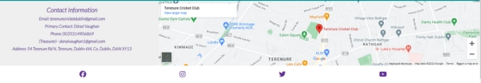

# Terenure Cricket Club
[View website Here!](<https://hills007.github.io/Terenure-Cricket-club/>)

Terenure cricket club website is designed to target players of all ages between 7 & upwards, who are looking to play cricket at all levels from having fun to being competitive members of the club.
Users of the website will be able to register on the web page and gather information regarding membership fees and different options of payments. They will also have access to view any Live matches for all the teams or check the upcoming fixtures and previous results. They will be able to view all images posted and have access to all social media platforms. They will also have access to all the contacts needed to pay their yearly subscriptions.

## • User Stories:

    ### First time Visitor:
  
           a. As a first time visitor to the website, I want to  know more about the club and its history.
      
           b. I want to know if the club is diverse and family oriented.
      
           c. I want to know what days they train and what is the cost of joining the club.
      
           d. I want to know what facilities they have and whether or not coaching is still available.
      
           e. I want to know how trusted and known they are by locating their social media platforms to see their following and club ratings.
      
    ### Returning Visitor:
  
           a. As a Returning visitor, I want to find information about the team's performance in the past year.
      
           b. I want to know find the best way to get in touch with the organisation with any questions I may have.

           c. I want to know about community links and events that the club holds.

           d. I want to know if there were any improvements made in the facilities of the club, i.e, Pitch replacements, nets, bowling machine and coaching etc.

    ### Frequent User:
  
           a. As a frequent user, I would like to be able to recieve newsletter with any major updates or changes to the website or organisation via email or social media.

           b. I would like to see if the teams are making progress in any of the competition across leinster cricket.

           c. I would like to know if there are any Live matches to follow online or be able to phsically go and support the club where possible.

           d. I would like to see an updated news section to stay up to date with any events taking place in the club. I.E, Charity events, Ceremonial events, Voluntary events etc.
      
## • Features:

### Navigation:

           a. Featured at the top of the page, the navigation section, shows the club name in the left corner: TerenureCC (Terenure Cricket Club) that links to the top of the page.
           
           b. The other navigation links are to the right: Home, About us, Membership, Gallery and Signup that links to different pages of the website.

           c. I chose two fonts for the website, Kaushan/cursive, and Lato/sans-serif and used a purple and green colour for the headings that matches the club jersey. 

           d. The navigation is very clear with the club`s name and website and makes different sections of information easy to find.

## • Home Page:

           a. Featured on the home page is a Hero image of one of the best palyers in the club while playing a drive. The image has a green gradient overlay on top.

           b. On top of the Hero image is a H1 heading with a welcome noe and paragraph underneath it mentioning new season registration is now open.

           c. Underneath the paragraph is a button with a hover tiltle Live matches. When clicked the button takes the user to the cricket leinster website where all the live matches are featured for the day.
           

## • Contact & Map:

           a. At the bottom of the home page , I have created the conatct section with name and details of a contact person and the club address.

           b. There is a map next to the contact section pin pointing the location of the club on the map.

