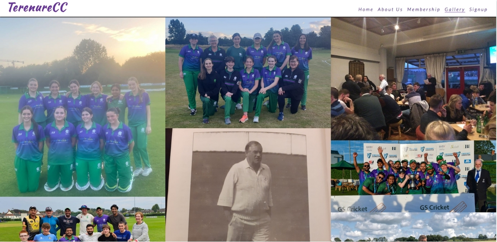

# Terenure Cricket Club

[View website Here!](https://hills007.github.io/Terenure-Cricket-club/)

Terenure cricket club website is designed to target players of all ages between 7 & upwards, who are looking to play cricket at all levels from having fun to being competitive members of the club.
Users of the website will be able to register on the web page and gather information regarding membership fees and different options of payments. They will also have access to view any Live matches for all the teams or check the upcoming fixtures and previous results. They will be able to view all images posted and have access to all social media platforms. They will also have access to all the contacts needed to pay their yearly subscriptions.

## • User Stories

    ### First time Visitor:

           a. As a first time visitor to the website, I want to  know more about the club and its history.

           b. I want to know if the club is diverse and family oriented.

           c. I want to know what days they train and what is the cost of joining the club.

           d. I want to know what facilities they have and whether or not coaching is still available.

           e. I want to know how trusted and known they are by locating their social media platforms to see their following and club ratings.

    ### Returning Visitor:

           a. As a Returning visitor, I want to find information about the team's performance in the past year.

           b. I want to know find the best way to get in touch with the organisation with any questions I may have.

           c. I want to know about community links and events that the club holds.

           d. I want to know if there were any improvements made in the facilities of the club, i.e, Pitch replacements, nets, bowling machine and coaching etc.

    ### Frequent User:

           a. As a frequent user, I would like to be able to recieve newsletter with any major updates or changes to the website or organisation via email or social media.

           b. I would like to see if the teams are making progress in any of the competition across leinster cricket.

           c. I would like to know if there are any Live matches to follow online or be able to phsically go and support the club where possible.

           d. I would like to see an updated news section to stay up to date with any events taking place in the club. I.E, Charity events, Ceremonial events, Voluntary events etc.

## • Features

### Navigation

           a. Featured at the top of the page, the navigation section, shows the club name in the left corner: TerenureCC (Terenure Cricket Club) that links to the top of the page.

           b. The other navigation links are to the right: Home, About us, Membership, Gallery and Signup that links to different pages of the website.

           c. I chose two fonts for the website, Kaushan/cursive, and Lato/sans-serif and used a purple and green colour for the headings that matches the club jersey.

           d. The navigation is very clear with the club`s name and website and makes different sections of information easy to find.

## • Home Page

           a. Featured on the home page is a Hero image of one of the best palyers in the club while playing a drive. The image has a green gradient overlay on top.

           b. On top of the Hero image is a H1 heading with a welcome noe and paragraph underneath it mentioning new season registration is now open.

           c. Underneath the paragraph is a button with a hover effect, tiltled, Live matches. When clicked, the button takes the user to the cricket leinster website where all the live matches are featured for the day.

### Contact & Map

           a. At the bottom of the home page , I have created the conatct section using flex property with name and details of a contact person and the club address to the left of the screen

           b. There is a map to the right of the contact section pin pointing the location of the club on the map. I also used the flex property here

### Footer

           a. At the bootom of the page is the footer section where the user can click on the four different icons that will take them to Terenure Cricket clubs social media platforms i.e, Facebook, Instagram, Twitter and Youtube.

## • About Us

           a. About us page features a black & white image of the club's previous members to the right of the screen and a brief description of the club history and community values to the left of the screen using flex property. This section has a backgroung image of Terenure crickect club ground.

 

### Fixtures & Results

           a. Fixtures and results section lies underneath the about us section and features two images side by side with buttons on top. Ai Image on the left has a player batting with a Fixtures button on top while the AI image on the right has a player bowling with a Results button on top. The buttons, when clicked takes the user to the cricket leinster website where all the fixtures and results of Terenure cricket club are displayed.

### Training

           a. Below the fixtures and results section is the training section. It feature the facilities that are on offer in the club in terms of coaching and equipment and also contains a table with training days and hours for all different age groups.

## • Membership

           a. The membership page gives details about the costs for differnt players of different age groups. It has four images that details membership fee for Family, Adult Male, Youth & Student and Female members. Below the membership section are details of different members to contact incase an individual wants to pay their membership fee or also have the option of paying the fee directly in to the bank. Bank details are mentiond to the right of the contact section. I used the flex property for the images and also for the table.

## • Gallery

           a. The gallery page feature images from different members and different teams of Terenure Cricket club.

## • Signup

           a. The Signup page features a registration form where new and old members can register for the upcoming season. The form contains an input box for email address, adult name, student & youth name and date of birth of the member.

## • Future Features

            a. Future features includes a news page where all the club events, articles on other websites, fundraising and social events would be advertised. It could also act as a newsletter to all the members that have registered.

            b. The signup page can also have a checkbox option of subscribe to newsletters, where users can opt to recieve or not recieve newsletters.

            c. Paying online for membership fees is also another option that the user could avail of in the future.

## • Testing & Bugs

             a. After conducting multiple tests, I can confirm that the website works perfectly as intended. All the color schemes blend well and the images align perfectly. All the buttons and social media links works well when clicked. The website is simply laid out for new users. The website gives all the relative information that a new or current user will need.

             b. I have conducted tests on all screen sizes fron mobile to talet to laptop and desktop and can confirm that every aspect of the website perfors perfectly. The images align nicely on all screen sizes and all the links are operational.

             c. I found a bug with the instagram link in the footer section. When clicked , it was giving a broken link error. All the pages links for instagram are now fixed and operational.

             d. I found a bug on the signup page with the date of birth input box. Input type value was changed from text to date and now that link works perfectly.

             e. I found that the Hero image on the home page was not aligning well on bigger screen sizes. I fixed the issue by resizing the image and uploading it again and that solved the problem. Now it displays nicely on all screen sizes. It also loads faster and have better performance on LPC.

## • Validator Testing

### HTML

             No errors were returned when passing through the official W3c Validator

[W3c Validator](https://validator.w3.org/)

### CSS

             No errors were found when passing through the official jigsaw validator

[Jigsaw validator](https://jigsaw.w3.org/css-validator/)

### Accessibility

             After resizing Hero image, The Dev tools lighthouse performance improved substacially. The results are mentioned in the image below.

## • Unfixed Bugs:

            a. Couldn't compress images on the membership page more to help with loading time. Lighthouse performance was showing at 84% for the membership page due to images sizes but doesn't effect the performance a great deal

            b. Couidn't remove the placeholder icon on the date of birth input box.

## • Deployment:

            a.The site was deployed to GitHub pages. The steps to deploy are as follows:
              In the GitHub repository, navigate to the Settings tab

            b.From the source section drop-down menu, select the Master Branch

            c.Once the master branch has been selected, the page will be automatically refreshed with a detailed ribbon display to indicate the successful deployment.

            The live link can be found below

<https://hills007.github.io/Terenure-Cricket-club/>

## • Credits:

            a. Majority of the project was created following the love running project code and css.

            b. Some ideas and code were taken from a youtube tutorial videos mentioned below.

<https://www.youtube.com/watch?v=lBfshkPlMW8&t=433s>
<https://www.youtube.com/watch?v=hlwlM4a5rxg&t=548s>

            c. W3school was also very helpful in understanding code, elements and attributes.

<https://www.w3schools.com/>

## Media:

            The photos used on the home, About us, Memebership and Gallery page are taken from Terenure cricket club Facebook page. Link is mentioned below

<https://www.facebook.com/TerenureCricketClub/>

            The images used for the fixtures and results section on the About us page were taken from Getty images on google. Link is mentioned below.

<https://www.gettyimages.ie/photos/cricket-batting>
